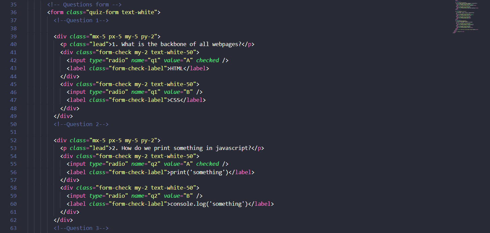
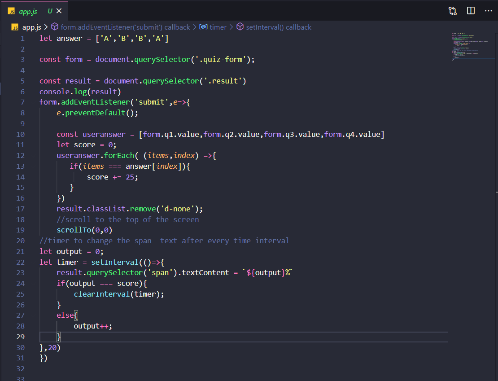

# Developer-Quiz-app
## A clean and interactive online quiz app

#### Feel free to change or customize as much as you want

#### It sound awesome if you have a much better ideas to improve this

#### Do contribute and share your ideas with all other developers so that they can take advantage of your customization

Table of Content
================

* * * * *

-   [Sections](#)
-   [Getting started](#)
-   [How to get files](#)
-   [Change and Customization](#)
-   [How this app's code help you](#)
-   [Deployment](#)

Getting Started
===============

* * * * *

These instructions will get you a copy of the project up and running on

your local machine for development and testing purposes

You will need [Git](#) and [Node.js](#)

How to get files
================

* * * * *

When you have done with installation!

Go to your required directory . and open GIT command line as shown below

Here you get a command line interface

put command to clone the files on your local computer

**\$ git clone https://github.com/fahadhassan1213/Developer-Quiz-app.git** 

Change and Customization
========================

* * * * *
If you want to change or add more questions you have to change test of _p_ tag in the __index.html__ file

You can change the **app.js** file to addd more functionalities to the app

How this app's code helps you
========================
In the _app.js_ file you can get the javascript code 

You can change the answers of your Question in _answers_ array

Or you can also connect a backend with this app to pick random questions on every time you open the app

By changing the value of _Score_ variable you can maximize on minimize the percentage of scoring on each question 

#### The following picture is divided into sections of code

Your task is to check the working of code and apply this code in you project and make your code more awesome

Deployment
========================
When you have done with the setup you should host your site online

You can use [NETLIFY](https://www.netlify.com/) for deployment of your

for more information please read [hosting on Netlify](https://create-react-app.dev/docs/deployment/#netlify)

