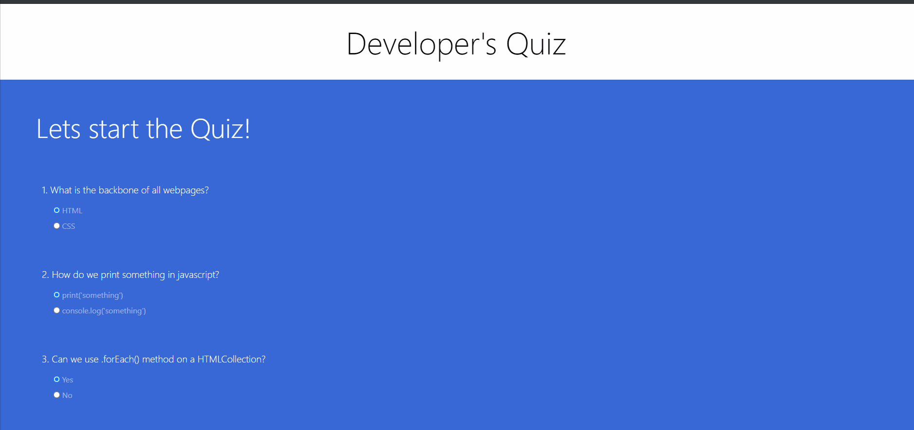
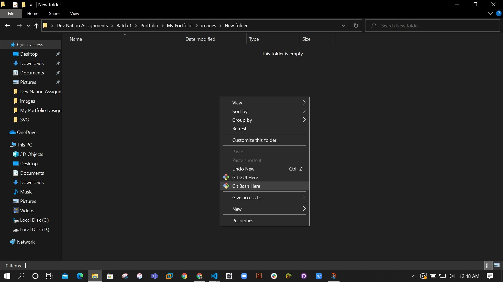

# Developer-Quiz-app
## A clean and interactive online quiz app

#### Visit the app by clicking this [Developer Quiz app](https://developerquiz1213.netlify.app/)


#### Feel free to change or customize as much as you want

#### It sound awesome if you have a much better ideas to improve this

#### Do contribute and share your ideas with all other developers so that they can take advantage of your customization

Table of Content
================

* * * * *

-   [Getting started](#)
-   [How to get files](#)
-   [Change and Customization](#)
-   [How this app's code help you](#)
-   [Deployment](#)


Getting Started
===============

* * * * *

These instructions will get you a copy of the project and running on

your local machine for development and testing purposes

You will need to install [Git](https://git-scm.com/downloads) and [Node.js](https://nodejs.org/en/download/) on your local machine/computer

How to get files
================

* * * * *

When you have done with installation!

Go to your required directory . and open GIT command line as shown below



Here you get a command line interface

put command to clone the files on your local computer

```git
\$ git clone https://github.com/fahadhassan1213/Developer-Quiz-app.git 
```
Change and Customization
========================

* * * * *
For Questions, you have to change test of _p_ tag in the `index.html` file
For Answers, you have to change the text of _Label_ tag in the `index.html` file
As show in picture below:

```html
<!-- Questions form -->
      <form class="quiz-form text-white">
        <!--Question 1-->

        <div class="mx-5 px-5 my-5 py-2">
          <p class="lead">1. What is the backbone of all webpages?</p>
          <div class="form-check my-2 text-white-50">
            <input type="radio" name="q1" value="A" checked />
            <label class="form-check-label">HTML</label>
          </div>
          <div class="form-check my-2 text-white-50">
            <input type="radio" name="q1" value="B" />
            <label class="form-check-label">CSS</label>
          </div>
        </div>
        <!--Question 2-->

        <div class="mx-5 px-5 my-5 py-2">
          <p class="lead">2. How do we print something in javascript?</p>
          <div class="form-check my-2 text-white-50">
            <input type="radio" name="q2" value="A" checked />
            <label class="form-check-label">print('something')</label>
          </div>
          <div class="form-check my-2 text-white-50">
            <input type="radio" name="q2" value="B" />
            <label class="form-check-label">console.log('something')</label>
          </div>
        </div>
        <!--Question 3-->

        <div class="mx-5 px-5 my-5 py-2">
          <p class="lead">
            3. Can we use .forEach() method on a HTMLCollection?
          </p>
          <div class="form-check my-2 text-white-50">
            <input type="radio" name="q3" value="A" checked />
            <label class="form-check-label">Yes</label>
          </div>
          <div class="form-check my-2 text-white-50">
            <input type="radio" name="q3" value="B" />
            <label class="form-check-label">No</label>
          </div>
        </div>
        <!--Question 4-->
        <div class="mx-5 px-5 my-5 py-2">
          <p class="lead font-weight-normal">
            4. What is a Developer's favorite array method?
          </p>
          <div class="form-check my-2 text-white-50">
            <input type="radio" name="q4" value="A" checked />
            <label class="form-check-label">.forEach()</label>
          </div>
          <div class="form-check my-2 text-white-50">
            <input type="radio" name="q4" value="B" />
            <label class="form-check-label">.Slice()</label>
          </div>
        </div>
```


You can change the `app.js` file to addd more functionalities to the app


How this app's code helps you
========================
In the`app.js` file you can get the javascript code 

```js

let answer = ['A','B','B','A']

const form = document.querySelector('.quiz-form');

const result = document.querySelector('.result')
console.log(result)
form.addEventListener('submit',e=>{
    e.preventDefault();

    const useranswer = [form.q1.value,form.q2.value,form.q3.value,form.q4.value]
    let score = 0;
    useranswer.forEach( (items,index) =>{
       if(items === answer[index]){
           score += 25;
       }
    })
```

You can change the answers of your Question in `answers` array

Or you can also connect a backend with this app to pick random questions on every time you open the app

By changing the value of `score` variable you can maximize on minimize the percentage of scoring on each question 

Deployment
========================
When you have done with the setup you should host your site online

You can use [NETLIFY](https://www.netlify.com/) for deployment of your

for more information please read [hosting on Netlify](https://create-react-app.dev/docs/deployment/#netlify)

